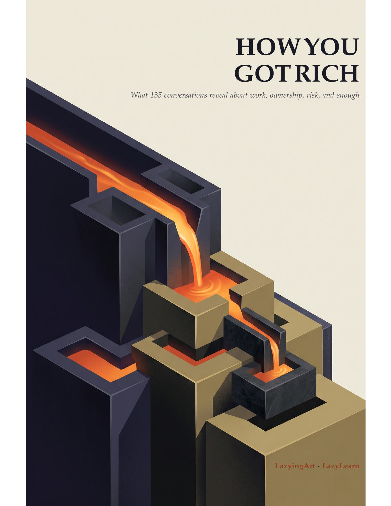

[English](../README.md) · [العربية](README.ar.md) · [Español](README.es.md) · [Français](README.fr.md) · [日本語](README.ja.md) · [한국어](README.ko.md) · [Tiếng Việt](README.vi.md) · [中文 (简体)](README.zh-Hans.md) · [中文（繁體）](README.zh-Hant.md) · [Deutsch](README.de.md) · [Русский](README.ru.md)

[](https://github.com/lachlanchen/lachlanchen/blob/main/figs/banner.png)

# How You Got Rich

### 从富足到满足与知足

[](https://lachlanchen.github.io/HowYouGotRich/)
[](../editions/how-you-got-rich.pdf)
[](../editions/how-you-got-rich-pocket-1.2x.pdf)
[](https://github.com/sponsors/lachlanchen)

<p align="center"><a href="https://lachlanchen.github.io/HowYouGotRich/reader.html"></a></p>

《*How You Got Rich*》坦率地追问：人们如何创造、守住并运用财富，又如何让
财富成为自由，而不是一场没有终点的地位竞赛。School of Hard Knocks 的
访谈构成全书的人物与证据主线。书中的成功故事会同时面对失败、运气、起点、
激励、生存者偏差，以及由他人承担的代价。

## 更完整的财富定义

| 富足 · Abundance | 满足 · Fulfillment | 知足 · Contentment |
| --- | --- | --- |
| 拥有足够的资源、能力、关系、时间、韧性和选择，不再长期受困于匮乏。 | 把工作与生活用于值得付出心力的目标。 | 在积累反过来支配人生之前，仍有辨认“已经足够”的自由。 |

财务自由的意义，在于它能为三者腾出空间；它却不能替我们决定该如何使用
这些空间。

## 阅读本书

| 形式 | 适合场景 | 打开 |
| --- | --- | --- |
| 图书网站 | 了解主旨、结构、版本与更新 | [访问](https://lachlanchen.github.io/HowYouGotRich/) |
| 浏览器阅读器 | 按部与章节导航完整图书 | [阅读](https://lachlanchen.github.io/HowYouGotRich/reader.html) |
| 网页版 | 持续完善的无障碍章节视图 | [探索](https://lachlanchen.github.io/HowYouGotRich/book.html) |
| 全尺寸 PDF · 162 页 | 打印、桌面与大屏平板 | [下载](../editions/how-you-got-rich.pdf) |
| 口袋版 1.2x PDF · 312 页 | 电纸书、小屏设备与 6x9 印刷 | [下载](../editions/how-you-got-rich-pocket-1.2x.pdf) |

V2 将永久保留[全尺寸版](../editions/v2/how-you-got-rich-v2.pdf)和
[口袋版 1.2x](../editions/v2/how-you-got-rich-v2-pocket-1.2x.pdf)。不带版本号
的链接，只有在新版本通过来源、编辑与版式审查后才会更新。

## 全书论证

| 部 | 核心问题 |
| --- | --- |
| I. 钱是为了什么 | 财富应当支撑怎样的人生？ |
| II. 创造有价值的事物 | 人们会选择、信任并为什么付费？ |
| III. 拥有那台机器 | 如何把努力变成能比创作者存续更久的资产？ |
| IV. 资本、风险与时间 | 如何让金钱复利增长，同时不毁掉它的主人？ |
| V. 自由与足够 | 当生存不再是唯一问题，财富究竟为了什么？ |

## 构建与验证

请安装包含 `pdflatex` 的 TeX Live，以及 `python3`、`rsync`、Poppler 和
`qpdf`。

```bash
make full
make pocket
make verify
make verify-site
make serve
```

网站源码位于 [`docs/`](../docs/)，可编辑书稿位于 [`source/`](../source/)。

## 来源与致谢

本书是独立整理与写作，主要基于由 **James Dumoulin** 主持的 **School of
Hard Knocks** 访谈，以及每位受访者分享的经历。收录他们的故事，并不表示
他们审阅或认可本书。[`sources/interviews.csv`](../sources/interviews.csv)
记录了 135 项来源，但不会重新分发访谈转录。

欢迎改进来源忠实度、归属、推理、文字、无障碍体验与排版。参见
[`CONTRIBUTING.md`](../CONTRIBUTING.md) 与 [`RIGHTS.md`](../RIGHTS.md)。
本书由 [LazyingArt](https://lazying.art) 与
[LazyLearn](https://learn.lazying.art) 撰写和策划。

## 支持

| 捐赠 | PayPal | Stripe |
| --- | --- | --- |
| [](https://chat.lazying.art/donate) | [](https://paypal.me/RongzhouChen) | [](https://buy.stripe.com/aFadR8gIaflgfQV6T4fw400) |

## 引用

GitHub 会读取 [`CITATION.cff`](../CITATION.cff) 并提供引用导出。

```bibtex
@book{lazyingart2026howyougotrich,
  author    = {{LazyingArt LLC}},
  title     = {How You Got Rich: From Abundance to Fulfillment and Contentment},
  year      = {2026},
  publisher = {LazyingArt and LazyLearn},
  url       = {https://github.com/lachlanchen/HowYouGotRich}
}
```
